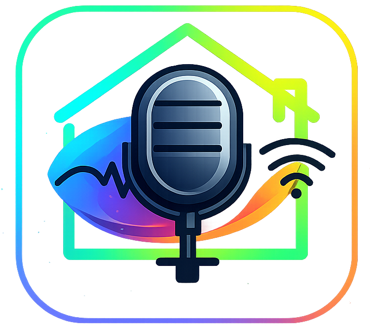
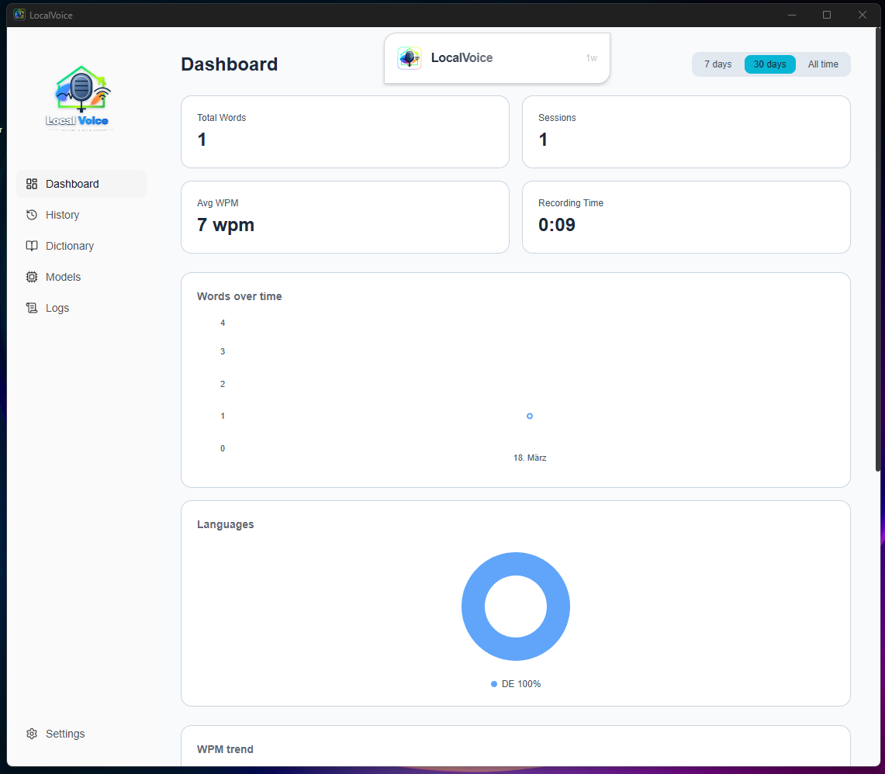
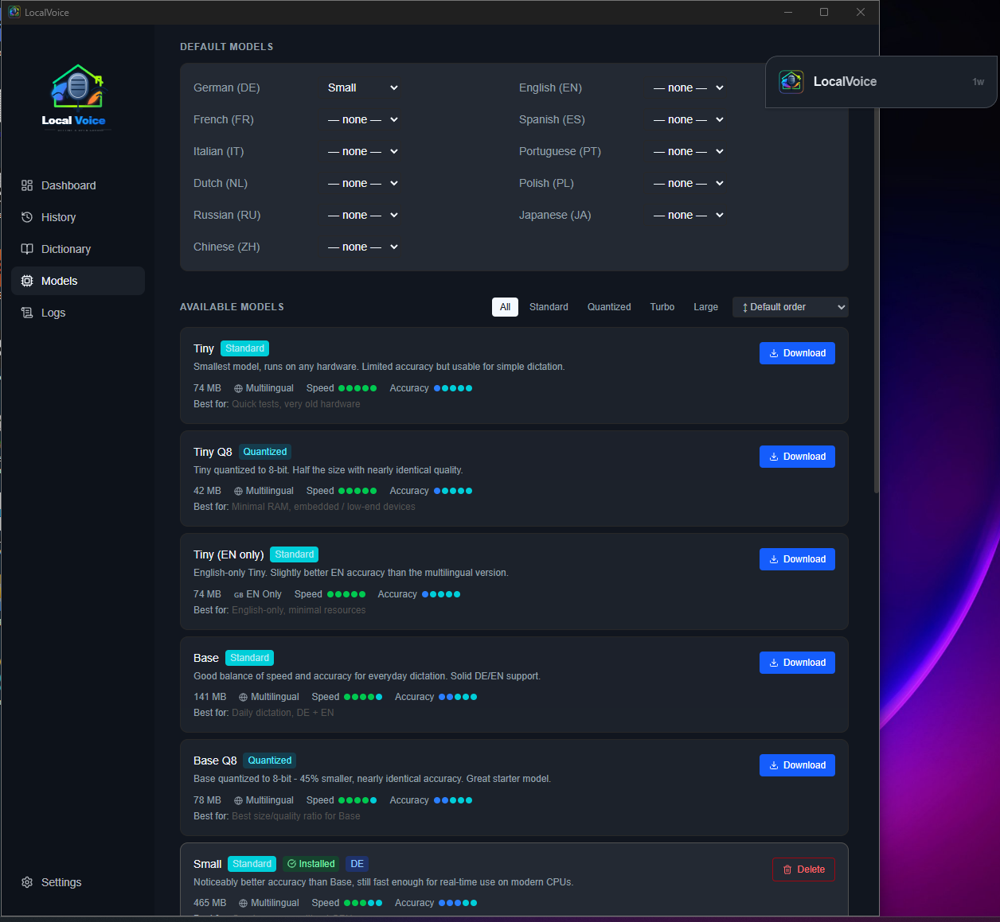
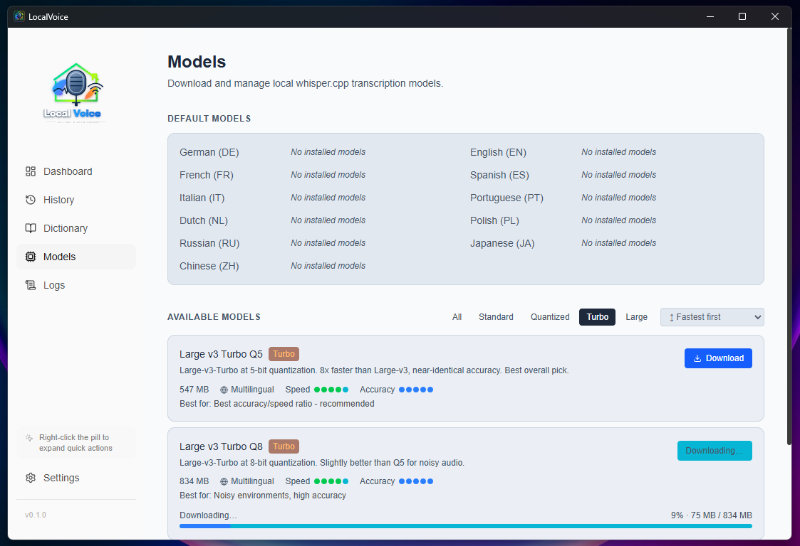
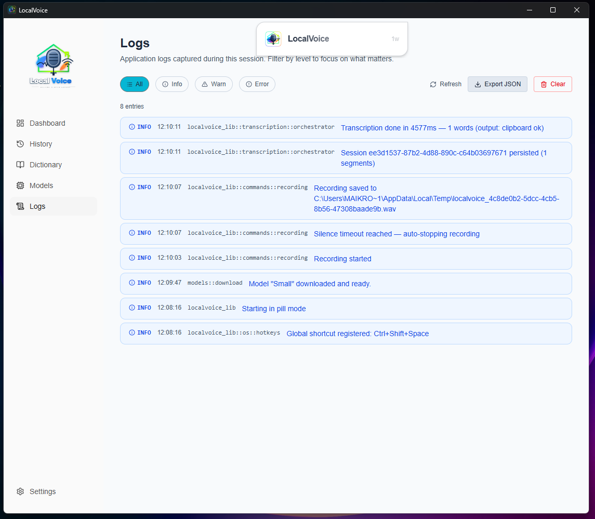

<div align="center">



# LocalVoice

**Offline-first desktop voice dictation — no cloud, no telemetry, just your voice.**

Record with a global shortcut, transcribe locally with [whisper.cpp](https://github.com/ggerganov/whisper.cpp), and send text straight to your clipboard or active app.

[](LICENSE)
[](https://tauri.app)
[](https://www.typescriptlang.org)
[](https://www.rust-lang.org)

</div>

---

## What is LocalVoice?

LocalVoice is a lightweight desktop app that turns your voice into text — entirely on your machine. There's no account to create, no audio sent to a server, and no subscription. Just press a shortcut, speak, and your words appear wherever your cursor is.

It's built for developers, writers, and anyone who wants fast, private voice input as part of their daily workflow.

---

## Key Features

- **Global hotkey recording** — start and stop dictation from anywhere on your desktop
- **100% local transcription** — powered by whisper.cpp; your audio never leaves your machine
- **Multiple Whisper models** — download and switch between models per language
- **Smart output** — insert directly into the active app, copy to clipboard, or preview first
- **Custom dictionary** — teach LocalVoice your vocabulary, acronyms, and corrections
- **Filler word removal** — automatically strips "um", "uh", and other fillers
- **Ambiguity detection** — flags low-confidence phrases for your review
- **Session history** — browse past transcriptions with confidence scores and word counts
- **Dashboard & analytics** — WPM trends, language breakdown, correction metrics
- **Session reprocessing** — re-run post-processing on past sessions with updated rules
- **Compact pill UI** — a small floating window that stays out of your way
- **Themes & shortcuts** — light, dark, or system theme; fully configurable hotkeys
- **No telemetry** — zero data collection, ever

---

## Tech Stack

| Layer | Technology |
|---|---|
| Desktop framework | [Tauri v2](https://tauri.app) |
| Frontend | React 19, TypeScript 5.8, Vite |
| Styling | Tailwind CSS v4, shadcn/ui, Radix UI |
| State management | Zustand |
| Backend | Rust (stable ≥ 1.77) |
| Database | SQLite (bundled via rusqlite) |
| Transcription | whisper.cpp (local sidecar binary) |
| Audio capture | cpal, hound |

---

## Screenshots

<table>
  <tr>
    <td align="center">
      
      <br/><sub>Dashboard — usage stats, WPM trend &amp; language breakdown</sub>
    </td>
    <td align="center">
      
      <br/><sub>Model Manager — download whisper.cpp models (dark theme)</sub>
    </td>
  </tr>
  <tr>
    <td align="center">
      
      <br/><sub>Model Manager — per-language defaults &amp; installed models (light theme)</sub>
    </td>
    <td align="center">
      
      <br/><sub>Log Viewer — filterable in-app debug logs with JSON export</sub>
    </td>
  </tr>
</table>

---

## Installation

### Prerequisites

| Tool | Version |
|---|---|
| Node.js | ≥ 20 |
| pnpm | ≥ 9 |
| Rust | stable ≥ 1.77 |

> On Windows, no additional system libraries are needed — SQLite is bundled.
> On macOS/Linux, make sure you have the standard build tools (`xcode-select --install` on macOS, `build-essential` on Ubuntu).

### Quick Setup (recommended)

Clone the repo and run the bootstrap script — it handles dependencies, whisper binaries, and build verification automatically.

**Windows (PowerShell):**
```powershell
git clone https://github.com/your-username/localvoice.git
cd localvoice
.\scripts\bootstrap.ps1
```

**macOS / Linux:**
```bash
git clone https://github.com/your-username/localvoice.git
cd localvoice
./scripts/bootstrap.sh
```

The script will:
1. Check for Node.js, Rust, and pnpm (and install pnpm if missing)
2. Install frontend dependencies
3. Download the whisper.cpp binaries (skip with `--skip-whisper`)
4. Verify the Tauri CLI is available
5. Run a Rust compilation check (skip with `--skip-verification`)

### Manual Setup

If you prefer to wire things up yourself:

```bash
# Install frontend dependencies
pnpm install

# Start the dev server (hot-reload frontend + Rust watch)
pnpm tauri dev

# Production build
pnpm tauri build
```

### whisper.cpp Binaries (required)

The bootstrap script tries to download and place these automatically, but if it fails — or if you're setting up manually — you need to do this step yourself. The app won't build or run without it.

**1. Download the release ZIP from the whisper.cpp GitHub releases page:**

```
https://github.com/ggerganov/whisper.cpp/releases/download/v1.7.1/whisper-bin-win-x64.zip
```

**2. Extract the ZIP.** Inside you'll find a `Release/` folder containing the binaries.

**3. Copy the following files from `Release/` into `src-tauri/binaries/`:**

| File | Rename to |
|---|---|
| `whisper-cli.exe` | `whisper-cli-x86_64-pc-windows-msvc.exe` |
| `ggml.dll` | `ggml.dll` |
| `ggml-base.dll` | `ggml-base.dll` |
| `ggml-cpu.dll` | `ggml-cpu.dll` |
| `whisper.dll` | `whisper.dll` |
| `SDL2.dll` | `SDL2.dll` |

> The `whisper-cli.exe` rename is required by Tauri's [sidecar naming convention](https://tauri.app/develop/sidecar/) — it must include the target triple suffix.

**4. Your `src-tauri/binaries/` folder should look like this:**

```
src-tauri/binaries/
  whisper-cli-x86_64-pc-windows-msvc.exe   ← renamed from whisper-cli.exe
  ggml.dll
  ggml-base.dll
  ggml-cpu.dll
  whisper.dll
  SDL2.dll
  .gitkeep
```

These files are excluded from version control (`.gitignore`). Every contributor needs to place them manually or run the bootstrap script.

---

## Configuration

LocalVoice stores all settings in a local SQLite database — no config files to edit by hand. Everything is configurable through the app's Settings page:

| Setting | Description |
|---|---|
| Recording shortcut | Global hotkey to start/stop recording |
| Output mode | Insert to active app, clipboard, or preview |
| Default language | Language used for transcription |
| Active Whisper model | Per-language model selection |
| Theme | System, light, or dark |
| Filler words | Language-specific list of words to strip |
| Audio retention | Whether to keep raw audio after transcription |
| Logging | Enable/disable in-app debug logging |

---

## Usage

1. Launch LocalVoice — a small pill window appears on screen.
2. Press your configured shortcut (default: customizable in Settings) to start recording.
3. Speak. The pill animates to show it's listening.
4. Press the shortcut again (or let silence detection stop it automatically).
5. LocalVoice transcribes locally and sends the text to your active app or clipboard.

You can open the full dashboard at any time to browse history, manage models, edit your dictionary, review ambiguous phrases, and view usage stats.

---

## Project Structure

```
src/                  React/TypeScript frontend
src-tauri/
  src/
    commands/         Tauri IPC command handlers
    db/               SQLite layer (migrations, repositories)
    audio/            Recording and device management
    transcription/    whisper.cpp sidecar protocol
    postprocess/      Text cleaning, filler removal, corrections
    dictionary/       Custom vocabulary and correction rules
    os/               Tray, hotkeys, clipboard, text insertion
    state/            AppState shared across commands
    errors/           AppError / CmdResult types
docs/
  user/               User-facing guides
  dev/                Developer and architecture docs
scripts/              Bootstrap and utility scripts
```

Full developer reference: [docs/dev/index.md](docs/dev/index.md)

---

## Contributing

Contributions are welcome. Here's how to get involved:

**Reporting bugs**
Open an issue with a clear description, steps to reproduce, your OS, and the LocalVoice version. Attach logs from the in-app log viewer if relevant.

**Suggesting features**
Open a discussion or issue describing the use case and why it would be valuable. Check existing issues first to avoid duplicates.

**Submitting a pull request**
1. Fork the repo and create a branch from `main`: `git checkout -b feat/your-feature`
2. Follow the existing code style — Rust uses standard `rustfmt`, TypeScript uses the project's ESLint config
3. Keep PRs focused — one feature or fix per PR
4. Update or add documentation if your change affects user-facing behavior
5. Open the PR with a clear description of what changed and why

**Good first issues**
Look for issues tagged `good first issue` — these are scoped and well-documented entry points.

---

## License

MIT — see [LICENSE](LICENSE) for the full text.

---

<div align="center">
Built with <a href="https://tauri.app">Tauri</a> · Transcription by <a href="https://github.com/ggerganov/whisper.cpp">whisper.cpp</a>
</div>
