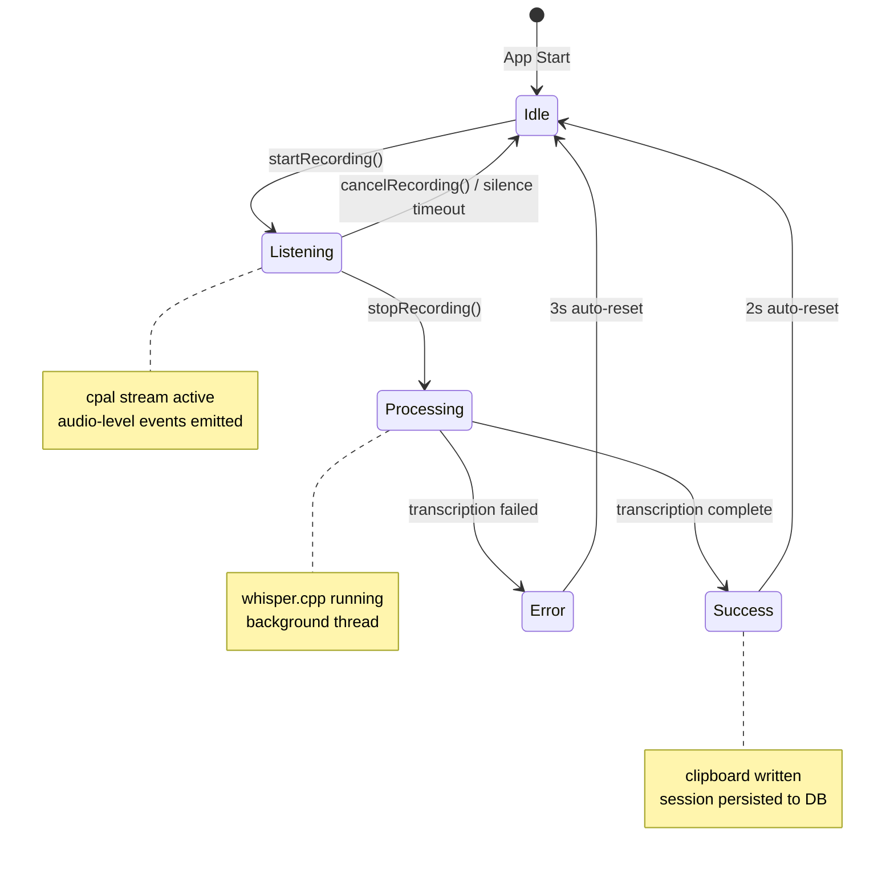
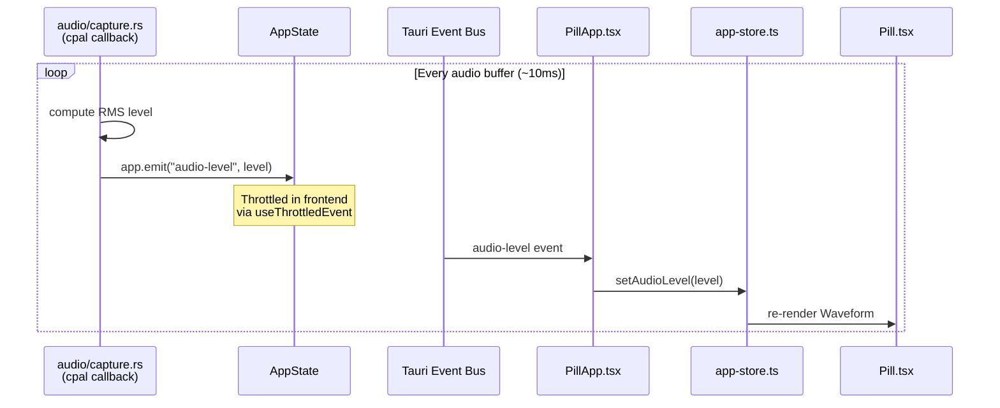
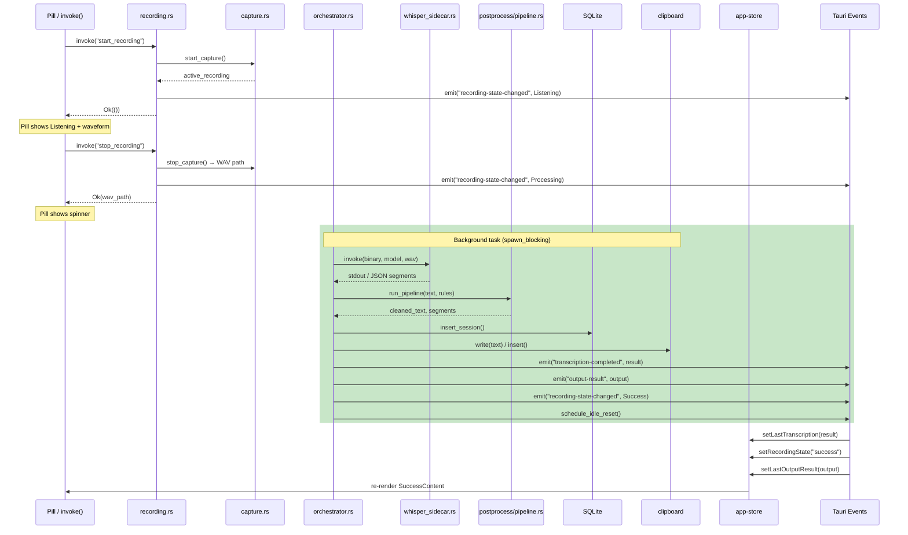

# State Flow Architecture

This document shows how state flows between Rust AppState, Tauri events/commands, Zustand stores, and React components.

## Overview

LocalVoice uses a dual-language architecture with two state synchronization patterns:

| Pattern | Mechanism | Direction | Latency |
|---------|-----------|-----------|---------|
| **Synchronous** | `invoke()` command | Frontend → Rust | ~ms (blocking) |
| **Asynchronous** | Tauri `emit()` event | Rust → Frontend | ~ms (non-blocking) |

## State Flow Diagram

```mermaid
flowchart TB
    subgraph Rust["Rust Backend (src-tauri/src)"]
        AppState["AppState<br/>(Arc&lt;Mutex&lt;...&gt;&gt;)"]
        
        subgraph AppState_fields["AppState Fields"]
            RS["recording_state: RecordingState<br/>(Idle|Listening|Processing|Success|Error)"]
            AR["active_recording: Option&lt;ActiveRecording&gt;<br/>(cpal Stream + samples)"]
            WAV["last_wav_path: Option&lt;String&gt;"]
            TR["last_transcription: Option&lt;TranscriptionResult&gt;"]
            RSA["recording_started_at: Option&lt;DateTime&gt;"]
        end
        
        subgraph Commands["Tauri Commands (#[tauri::command])"]
            REC["recording.rs<br/>start_recording / stop_recording / cancel_recording"]
            TRANS["transcription.rs<br/>transcribe_last_recording / reprocess_session"]
            HIST["history.rs<br/>list_sessions / get_session / delete_session"]
            DICT["dictionary.rs<br/>list_correction_rules / create_correction_rule / ..."]
            MOD["models.rs<br/>list_available_models / download_model / ..."]
            SETS["settings.rs<br/>get_settings / update_setting / ..."]
            SYST["system.rs / window.rs / filler_words.rs / stats.rs"]
        end
        
        subgraph BackendModules["Internal Modules (not exposed)"]
            AUD["audio/capture.rs<br/>cpal microphone capture"]
            WHIS["transcription/whisper_sidecar.rs<br/>whisper.cpp sidecar process"]
            POST["postprocess/pipeline.rs<br/>dictionary rules, fillers, normalization"]
            DB["db/repositories/*<br/>SQLite persistence"]
        end
        
        Events["emit_recording_state()<br/>emit() → Tauri Events"]
    end
    
    subgraph TauriEvents["Tauri Event Bus"]
        RSE["recording-state-changed<br/>RecordingStatePayload"]
        TL["audio-level (throttled)<br/>number (0-1 RMS)"]
        TC["transcription-completed<br/>TranscriptionResult"]
        OR["output-result<br/>OutputResultPayload"]
        THM["theme-changed<br/>Theme"]
        NAV["navigate-to<br/>string"]
        SD["silence-detected<br/>unit"]
    end
    
    subgraph Frontend["React Frontend (src/)"]
        subgraph Stores["Zustand Stores"]
            APP["app-store.ts<br/>recordingState, audioLevel, lastTranscription,<br/>lastOutputResult, isPillExpanded"]
            SETS_F["settings-store.ts<br/>settings cache"]
            HIST_F["history-store.ts<br/>sessions list + detail"]
            DICT_F["dictionary-store.ts<br/>entries, rules, ambiguous terms"]
            MOD_F["models-store.ts<br/>available + installed models"]
            DASH["dashboard-store.ts<br/>stats, timeseries, language breakdown"]
            FILL["filler-words-store.ts<br/>filler words + stats"]
            AMB["ambiguity-store.ts<br/>ambiguous terms"]
        end
        
        subgraph Components["React Components"]
            PILL["Pill.tsx<br/>listens to recording-state-changed,<br/>audio-level, transcription-completed"]
            EXP["ExpandedPill.tsx<br/>latest transcript, quick actions"]
            MAIN["MainApp.tsx<br/>listen to navigate-to, theme-changed"]
            HIST_P["History.tsx<br/>listSessions, getSessionDetail, deleteSession"]
            DICT_P["Dictionary.tsx<br/>dictionary CRUD via invoke()"]
            MOD_P["Models.tsx<br/>model list + download via invoke()"]
            SET_P["SettingsPage.tsx<br/>settings via invoke(), listInputDevices"]
            DASH_P["Dashboard.tsx<br/>getDashboardStats, getUsageTimeseries"]
            SB["Sidebar.tsx<br/>navigation"]
        end
    end
    
    subgraph External["External Systems"]
        MIC["Microphone<br/>(cpal)"]
        WHISPER["whisper.cpp<br/>(sidecar process)"]
        FS["Filesystem<br/>(WAV, models, DB)"]
        CB["System Clipboard"]
    end

    %% Recording Flow
    REC -->|start| AUD
    REC -->|set| RS
    REC -->|set| AR
    REC -->|emit| RSE
    AUD -->|audio samples| AR
    AUD -->|audio-level| TL
    
    REC -->|stop| WAV
    REC -->|Processing| RSE
    
    %% Transcription Flow
    TRANS -->|read| WAV
    TRANS -->|invoke| WHISPER
    WHISPER -->|stdout JSON| TRANS
    TRANS -->|run| POST
    POST -->|apply rules| DB
    POST -->|store| TR
    TRANS -->|emit| TC
    TRANS -->|emit| RSE
    POST -->|write| CB
    
    %% AppState mutations
    Events -->|update| RS
    REC -->|modify| AppState
    TRANS -->|modify| AppState
    
    %% Event bus to frontend
    RSE -->|listen| APP
    TL -->|throttled listen| APP
    TC -->|listen| APP
    OR -->|listen| APP
    THM -->|listen| MAIN
    NAV -->|listen| MAIN
    
    %% Stores to components
    APP -->|useAppStore| PILL
    APP -->|useAppStore| EXP
    APP -->|useAppStore| SET_P
    
    %% Invoke commands (sync)
    PILL -->|"invoke(startRecording)"| REC
    PILL -->|"invoke(stopRecording)"| REC
    PILL -->|"invoke(cancelRecording)"| REC
    
    SET_P -->|"invoke(listInputDevices)"| REC
    SET_P -->|"invoke(getSettings)"| SETS
    SET_P -->|"invoke(updateSetting)"| SETS
    
    HIST_P -->|"invoke(listSessions)"| HIST
    HIST_P -->|"invoke(getSessionDetail)"| HIST
    HIST_P -->|"invoke(deleteSession)"| HIST
    
    DICT_P -->|"invoke(listDictionaryEntries)"| DICT
    DICT_P -->|"invoke(createCorrectionRule)"| DICT
    DICT_P -->|"invoke(updateCorrectionRule)"| DICT
    
    MOD_P -->|"invoke(listAvailableModels)"| MOD
    MOD_P -->|"invoke(downloadModel)"| MOD
    MOD_P -->|"invoke(deleteModel)"| MOD
    
    DASH_P -->|"invoke(getDashboardStats)"| SYST
    DASH_P -->|"invoke(getUsageTimeseries)"| SYST
    
    %% External interactions
    AUD -->|input| MIC
    WHISPER -->|read WAV| FS
    REC -->|write temp WAV| FS
    POST -->|write| CB
    
    %% Legend
    subgraph Legend["Legend"]
        L1["invoke() — synchronous command"]
        L2["emit() → listen — asynchronous event"]
        L3["direct state access"]
    end
```



## Recording State Transitions



## Sync vs Async Communication Patterns

### Synchronous (invoke commands) — Query & Control

Used when the frontend needs to:
- Trigger an action and wait for result
- Query persistent data (settings, history, models)

```
React Component → invoke(command) → Rust Command Handler
                                              ↓
                                    SQLite / System Call
                                              ↓
React Component ← Promise resolved ← Return value
```

**Example:** `startRecording()` → `stopRecording()` → WAV path returned

### Asynchronous (emit events) — Reactive State

Used when Rust needs to push updates to the UI:
- High-frequency updates (audio level)
- State transitions initiated by backend
- Background task completion

```
Rust Backend: emit(event, payload) → Tauri Event Bus → All Windows

Each Window:
  listen(event, handler) → update Zustand store → React re-render
```

**Example:** `emit_recording_state(app, Listening)` → Pill updates immediately

## Audio Level Flow (High-Frequency)



## Transcription Flow (Background Task)



## Data Flow by Domain

### Recording Domain

| Data | Rust Location | Sync/Async | Frontend Store |
|------|--------------|------------|----------------|
| `recordingState` | `AppState.recording_state` | Event `recording-state-changed` | `app-store.recordingState` |
| `recordingError` | Event payload | Event `recording-state-changed` | `app-store.recordingError` |
| `audioLevel` | cpal callback | Event `audio-level` | `app-store.audioLevel` |
| `isPillExpanded` | Window state | invoke `expandPill/collapsePill` | `app-store.isPillExpanded` |

### Transcription Domain

| Data | Rust Location | Sync/Async | Frontend Store |
|------|--------------|------------|----------------|
| `lastTranscription` | `AppState.last_transcription` | Event `transcription-completed` | `app-store.lastTranscription` |
| `sessions` | `sessions_repo` | invoke `list_sessions` | `history-store.sessions` |
| `dashboardStats` | `stats/service.rs` | invoke `get_dashboard_stats` | `dashboard-store.stats` |

### Settings Domain

| Data | Rust Location | Sync/Async | Frontend Store |
|------|--------------|------------|----------------|
| `settings` | `settings_repo` | invoke `get_settings` / `update_setting` | `settings-store.settings` |
| `theme` | settings + event | invoke + Event `theme-changed` | `lib/theme.ts` |

## Key Implementation Notes

1. **Event listeners are registered in `PillApp.tsx`** — not in every component. This prevents duplicate listeners and centralizes state updates.

2. **High-frequency events are throttled** — `audio-level` uses `useThrottledEvent` to limit to ~60fps via `requestAnimationFrame`.

3. **Commands run on the Rust main thread** — they block until complete. Long-running operations (transcription) spawn background tasks and return immediately.

4. **AppState is thread-safe** — uses `Mutex<T>` for mutable state accessed from both sync commands and async background tasks.

5. **Events broadcast to all windows** — `app.emit()` sends to both pill and main window simultaneously.

6. **Zustand store updates trigger React re-renders** — only components subscribed to changed state slices re-render.
